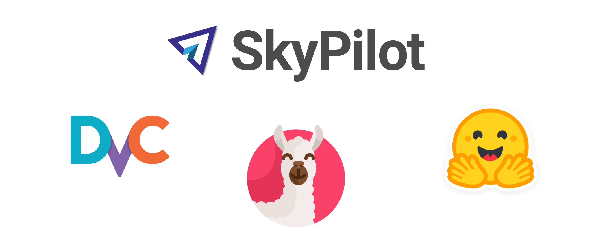
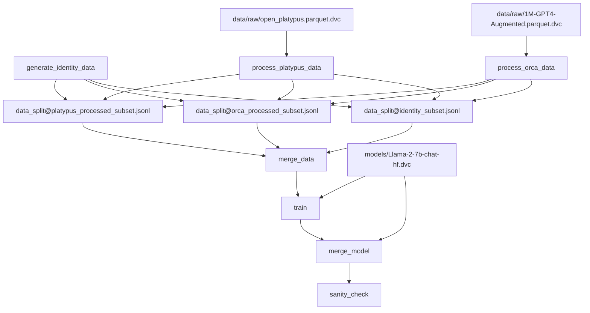

## Table of Contents

- [Table of Contents](#table-of-contents)
- [Fine-Tuning Large Language Models with a Production-Grade Pipeline](#fine-tuning-large-language-models-with-a-production-grade-pipeline)
  - [Overview](#overview)
    - [DVC for reproducible ML pipelines](#dvc-for-reproducible-ml-pipelines)
    - [SkyPilot for scalable cloud infrastructure](#skypilot-for-scalable-cloud-infrastructure)
    - [HuggingFace et al. for efficient training of quantized models](#huggingface-et-al-for-efficient-training-of-quantized-models)
  - [Setup](#setup)
  - [Usage](#usage)
    - [Developing and running experiments interactively in the cloud](#developing-and-running-experiments-interactively-in-the-cloud)
    - [Submit experiment jobs to the cloud](#submit-experiment-jobs-to-the-cloud)
    - [Customizing the cloud instance](#customizing-the-cloud-instance)
  - [Project structure](#project-structure)
    - [DVC pipeline stages](#dvc-pipeline-stages)
  - [References](#references)

## Fine-Tuning Large Language Models with a Production-Grade Pipeline
This project demonstrates using DVC, SkyPilot, and HuggingFace to build a production-grade pipeline for fine-tuning large language models.

🙏 Special thanks to [Iterative.ai](https://iterative.ai/) for providing cloud compute resources for this project.

### Overview
This project demonstrates an end-to-end production-grade ML pipeline for performing SFT (Supervised fine-tuning) of large language models on conversational data.
Here I use [DVC](https://github.com/iterative/dvc), [SkyPilot](https://github.com/skypilot-org/skypilot), [Transformers](https://github.com/huggingface/transformers) and [PEFT](https://github.com/huggingface/peft), [bitsandbytes](https://github.com/TimDettmers/bitsandbytes) and other libraries that provide the following advantages:

#### DVC for reproducible ML pipelines

- DVC allows defining the ML workflow as a DAG of pipeline stages. Dependencies between data, models, and metrics are automatically tracked.
- DVC integrates with remote storage like S3 to efficiently version large datasets and model files.
- All resulting artifacts (metrics, preprocessed data, and model weights) are logged and pushed to cloud after each run. Experiments are perfectly reproducible every single time.

#### SkyPilot for scalable cloud infrastructure

- SkyPilot makes it easy to launch cloud compute resources on demand for development or distributed training.
- Spot instances can be leveraged via SkyPilot to reduce training costs.
- Remote interactive development environments can be quickly set up with SkyPilot e.g. spinning up cloud GPU instance for VS Code or Jupyter.

#### HuggingFace et al. for efficient training of quantized models

- HuggingFace Transformers provides an easy-to-use API for training and fine-tuning large transformer models.
- Integration with bitsandbytes enables reduced-precision and quantization-aware training for greater efficiency.
- PEFT from HuggingFace allows parameter-efficient fine-tuning of only a small portion of the large model.

By combining these complementary technologies, the pipeline enables cost-effective, reproducible and scalable experiments.

### Setup
1. Clone this repo
2. Install SkyPilot and DVC: `pip install skypilot dvc[all]`. There's no need to install all dependencies from `requirements.txt` because all development and experimentation will be done in the cloud.
3. Configure your cloud provider credentials. See [SkyPilot docs](https://skypilot.readthedocs.io/en/latest/getting-started/installation.html#cloud-account-setup) for details.
4. Verify the setup by running `sky check`
5. You'll also need to do a one-time data transfer from an S3 bucket used here to your own bucket:
    - Run `dvc pull` to download the data from the remote storage used here to your local machine.
    - Create a bucket in your cloud provider account and change the `url` in `.dvc/config` to point to your cloud bucket
        - [AWS](https://iterative.ai/blog/aws-remotes-in-dvc)
        - [GCP](https://iterative.ai/blog/using-gcp-remotes-in-dvc)
        - [Azure](https://iterative.ai/blog/azure-remotes-in-dvc)
    - Run `dvc push` to upload the data to your bucket.

### Usage

You can either develop the project and run experiments interactively in the cloud inside VS Code, or submit run job to the cloud and pull the results to your local machine.

#### Developing and running experiments interactively in the cloud

To launch a cloud instance for interactive development, run:

```bash
sky launch -c vscode sky-vscode.yaml
```

This will launch a VS Code tunnel to the cloud instance. You'll need to authenticate with your GitHub account to allow the tunnel to be created.
Once the tunnel is created, you can open the VS Code instance in your browser by clicking the link in the terminal output.
In addition to installing all dependencies, it installs [`nvtop`](https://github.com/Syllo/nvtop) for monitoring GPU usage.

#### Submit experiment jobs to the cloud

When you are ready to launch a long-tunning training job, run:

```bash
sky launch -c train --use-spot -i 30 --down sky-training.yaml
```
- `--use-spot` will use spot instances to save money.
- `-i 30 --down` will automatically terminate the instance after 30 minutes of idleness. Remove `--down` to only stop the instance, but not terminate it.

Once the experiment is complete, its artifacts (model weights, metrics, etc.) will be stored in your bucket (DVC remote storage).
You can pull the results of the experiment to your local machine by running:

```bash
dvc exp pull origin
```

#### Customizing the cloud instance

The above `sky launch` commands will launch a cloud instance and
perform the setup and job execution defined in either `sky-training.yaml` or `sky-vscode.yaml`.
You can modify the `resources` section to change the cloud provider and instance type.

Optionally, add `--env DVC_STUDIO_TOKEN` to the command to enable [Iterative Studio integration](https://dvc.org/doc/studio/user-guide/projects-and-experiments/live-metrics-and-plots) for real-time monitoring of metrics and plots.


### Project structure

The key components are:

- `requirements.txt` - contains the Python dependencies for the project
- `dvc.yaml` - defines the DVC pipeline stages for data processing, model training, etc.
- `params.yaml` - central configuration file containing hyperparameters and other parameters
- `.dvc/config` - defines the remote storage for DVC artifacts
- `dvclive` - contains the metrics and plots generated by [DVCLive](https://dvc.org/doc/dvclive/ml-frameworks/huggingface)'s integration with HuggingFace
- `src/` - contains Python scripts for each pipeline stage
- `data/` - contains raw data, processed data, and split train/val data
- `models/` - contains pretrained and fine-tuned models
- `sky-training.yaml` - defines the cloud instance setup and job execution for training
- `sky-vscode.yaml` - defines the cloud instance setup for interactive development in VS Code
- `sanity_check_result/` - contains the outputs of the pretrained and fine-tuned models on a small number of test prompts


#### DVC pipeline stages

DVC pipeline `dvc.yaml` stages and what they do:

- `generate_identity_data`: Generates a small subset of hardcoded conversational data about the model's identity, creators, etc. saved to `identity_subset.jsonl`.
- `process_orca_data`: Takes a subset of the [Open Orca](https://huggingface.co/datasets/Open-Orca/OpenOrca) dataset and converts it to the prompt/completion format, saving to `orca_processed_subset.jsonl`. 
- `process_platypus_data`: Similarly processes a subset of the [Open Platypus](https://huggingface.co/datasets/garage-bAInd/Open-Platypus) dataset.
- `data_split`: Splits each of the 3 processed dataset files into train/validation sets. 
- `merge_data`: Concatenates all the train splits and all the validation splits into final `train.jsonl` and `val.jsonl`.
- `train`: Fine-tunes a Llama-2 model on the training data using the [PEFT](https://github.com/huggingface/peft) library and [Supervised Fine-tuning Trainer](https://huggingface.co/docs/trl/main/en/sft_trainer). Saves fine-tuned model adapters.
- `merge_model`: Merges the fine-tuned adapter back into the original Llama-2 model.
- `sanity_check`: Runs a few prompts through the original and fine-tuned model for a quick [sanity check report](sanity_check_result/result.csv).

The `params.yaml` file contains the project's configuration values and training hyperparameters. 

You can try a larger model by changing the `train.model_size` parameter to `13b` (you might need to either request a larger instance or reduce the batch size to fit in GPU memory).





### References

- [PEFT: Parameter-Efficient Fine-Tuning of Billion-Scale Models on Low-Resource Hardware](https://huggingface.co/blog/peft)
- [Making LLMs even more accessible with bitsandbytes, 4-bit quantization and QLoRA](https://huggingface.co/blog/4bit-transformers-bitsandbytes)
- [Fine-Tuning Llama-2: A Comprehensive Case Study for Tailoring Models to Unique Applications](https://www.anyscale.com/blog/fine-tuning-llama-2-a-comprehensive-case-study-for-tailoring-models-to-unique-applications)
- [Fine-Tune Your Own Llama 2 Model in a Colab Notebook](https://mlabonne.github.io/blog/posts/Fine_Tune_Your_Own_Llama_2_Model_in_a_Colab_Notebook.html)
- [Finetuning Llama 2 in your own cloud environment, privately](https://blog.skypilot.co/finetuning-llama2-operational-guide/)
